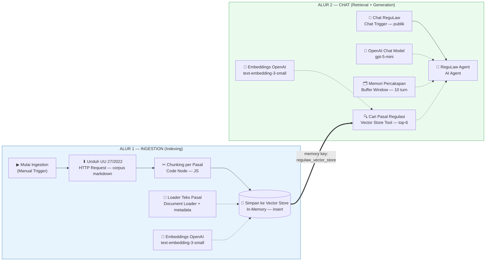
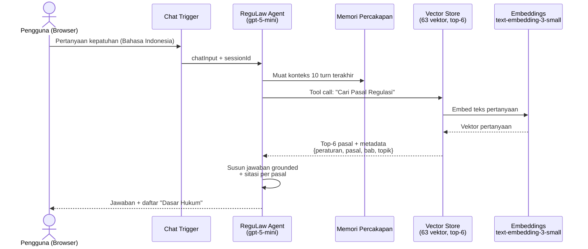
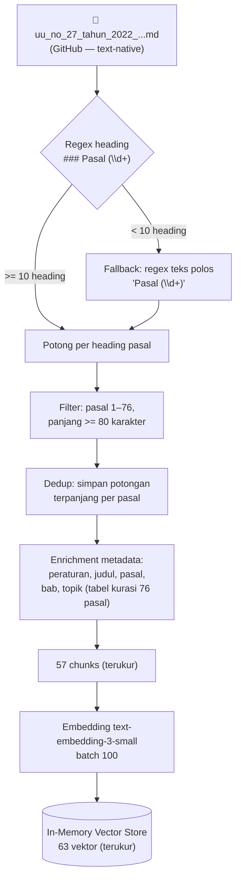

# ReguLaw RAG — Tanya Jawab Kepatuhan Regulasi Fintech

**Dokumentasi Teknis Workflow (Laporan Proyek Akhir)**

| | |
|---|---|
| **Nama** | Rofiq Fauzi (P36.2026.00047) |
| **Program Studi** | Magister Artificial Intelligence, Universitas Dian Nuswantoro |
| **Mata Kuliah** | Introduction to Generative AI (20261-P36102), Kelas P3612 |
| **Tanggal** | 3 Oktober 2026 |
| **Platform** | n8n Cloud (instance: ropix.app.n8n.cloud) |
| **Workflow ID** | `7PXZ67WqkZbYphvp` |
| **Versi aktif** | `aaa37b47-9251-4ce6-a985-5bbde179fd2d` (published) |
| **URL Chat Publik** | https://ropix.app.n8n.cloud/webhook/a1ce822a-b5a3-4b6e-b029-c18d234f6420/chat |

---

## 1. Latar Belakang dan Tujuan

ReguLaw RAG adalah prototipe sistem tanya-jawab (*question answering*) kepatuhan regulasi fintech Indonesia berbasis **Retrieval-Augmented Generation (RAG)**. Sistem ini dikembangkan dari esai Tugas 1 "ReguLaw RAG" dan bertujuan:

1. Menjawab pertanyaan kepatuhan regulasi dalam Bahasa Indonesia dengan jawaban yang **grounded** (berlandaskan dokumen regulasi, bukan halusinasi model).
2. Menyertakan **sitasi peraturan dan pasal** pada setiap jawaban untuk akuntabilitas.
3. Menolak menjawab pertanyaan di luar korpus regulasi yang tersedia.

Korpus yang digunakan pada versi ini adalah **UU No. 27 Tahun 2022 tentang Pelindungan Data Pribadi (UU PDP)** dalam format markdown text-native yang di-hosting di GitHub.

---

## 2. Diagram Arsitektur

Diagram berikut menggunakan sintaks **Mermaid** — otomatis ter-render sebagai gambar di GitHub, GitLab, Typora, Obsidian, dan VS Code (ekstensi Markdown Preview Mermaid).

### 2.1 Diagram Alur Keseluruhan



### 2.2 Diagram Sequence — Satu Sesi Tanya-Jawab



### 2.3 Diagram Pipeline Ingestion (Detail Data)



> **Catatan render:** bila format akhir laporan adalah Word/PDF, diagram Mermaid di atas dapat di-render menjadi gambar PNG/SVG melalui https://mermaid.live (paste kode → Export), lalu disisipkan sebagai gambar.

---

## 3. Arsitektur Sistem

Workflow terdiri dari **11 node** yang terbagi dalam dua alur:

### Alur 1 — Ingestion (Indexing)

```
Mulai Ingestion (Manual)
  → Unduh UU 27-2022 (JDIH BPK)     [HTTP Request — GET corpus markdown]
  → Chunking per Pasal              [Code — pemotongan per pasal + metadata]
  → Simpan ke Vector Store          [Vector Store InMemory — insert]
       ├─ Embeddings OpenAI         [text-embedding-3-small]
       └─ Loader Teks Pasal         [Document Default Data Loader]
```

### Alur 2 — Chat (Retrieval + Generation)

```
Chat ReguLaw                      [Chat Trigger — hosted chat publik]
  → ReguLaw Agent                 [AI Agent]
       ├─ OpenAI Chat Model       [gpt-5-mini]
       ├─ Memori Percakapan       [Memory Buffer Window]
       └─ Cari Pasal Regulasi     [Vector Store Tool — retrieval top-6]
            └─ Embeddings OpenAI  [text-embedding-3-small]
```

---

## 4. Kode dan Penjelasan per Node

Seluruh workflow didefinisikan sebagai kode TypeScript (`@n8n/workflow-sdk`) pada file `src/workflows/regulaw-rag.workflow.ts`. Berikut rincian setiap node dengan kode konfigurasi aktualnya.

### 4.1 Trigger — Mulai Ingestion (Manual)

```ts
const mulai_Ingestion_Manual = trigger({
  type: 'n8n-nodes-base.manualTrigger',
  version: 1,
  config: { name: 'Mulai Ingestion (Manual)' }
});
```

**Penjelasan:** Titik masuk alur ingestion. Dipicu manual dari editor n8n (atau eksekusi terjadwal di masa depan). Tidak menerima input eksternal — hanya memulai rantai unduh → chunking → simpan vektor.

---

### 4.2 Node — Unduh UU 27-2022 (JDIH BPK)

```ts
const unduh_UU_27_2022_JDIH_BPK = node({
  type: 'n8n-nodes-base.httpRequest',
  version: 4.5,
  config: { name: 'Unduh UU 27-2022 (JDIH BPK)', parameters: {
    method: 'GET',
    url: 'https://raw.githubusercontent.com/rofiqf/regulaw/main/uu_no_27_tahun_2022_pelindungan_data_pribadi_rag_optimized.md',
    options: {
      response: { response: { responseFormat: 'text' } },
      redirect: { redirect: { followRedirects: true, maxRedirects: 21 } },
      timeout: 60000
    }
  } }
});
```

**Penjelasan:** Mengunduh corpus UU 27/2022 dalam format markdown text-native dari repositori GitHub. `responseFormat: 'text'` memastikan isi file diterima sebagai string mentah (bukan di-parse sebagai JSON), dan `timeout: 60000` memberi batas 60 detik. Awalnya node ini mengunduh PDF resmi JDIH BPK, tetapi sumber tersebut diblokir Cloudflare (HTTP 403) dan PDF hasil scan menimbulkan artefak OCR yang merusak chunking — sehingga diganti ke corpus markdown yang bersih.

---

### 4.3 Node — Chunking per Pasal (inti strategi RAG)

```js
const META = { peraturan: 'UU 27/2022', judul: 'Pelindungan Data Pribadi',
               penerbit: 'DPR & Pemerintah RI', tahun: 2022 };

// Tabel kurasi: pasal -> { bab, topik } berdasarkan struktur resmi UU 27/2022
const TOPIK = {
  1: ['I', 'Ketentuan Umum'],
  2: ['II', 'Asas Pelindungan Data Pribadi'],
  /* ... pemetaan lengkap 76 pasal ... */
  57: ['X', 'Sanksi Administratif'],
  67: ['XV', 'Ketentuan Pidana'],
  76: ['XVI', 'Ketentuan Penutup'],
};

let text = '';
for (const item of $input.all()) {
  const v = item.json.data ?? item.json.text ?? '';
  text += (typeof v === 'string' ? v : JSON.stringify(v)) + '\n';
}
text = text.replace(/\r/g, '');

// Potong berdasarkan heading markdown "### Pasal <angka>" (file md text-native)
const pasalRegex = /^#{1,4}\s*Pasal\s+(\d+)\b/gm;
let matches = [...text.matchAll(pasalRegex)];

// Fallback untuk teks polos tanpa heading markdown
if (matches.length < 10) {
  matches = [...text.matchAll(/Pasal\s+(\d+)\b/g)];
}

const chunks = new Map(); // pasal -> text
for (let i = 0; i < matches.length; i++) {
  const num = parseInt(matches[i][1], 10);
  if (num < 1 || num > 76) continue;      // UU PDP hanya sampai Pasal 76
  const start = matches[i].index;
  const end = i + 1 < matches.length ? matches[i + 1].index : text.length;
  const piece = text.slice(start, end).trim();
  if (piece.length < 80) continue;        // artefak daftar isi

  // Dedup: simpan potongan terpanjang per pasal
  if (!chunks.has(num)) chunks.set(num, piece);
  else if (piece.length > chunks.get(num).length) chunks.set(num, piece);
}

return [...chunks.entries()]
  .sort((a, b) => a[0] - b[0])
  .map(([pasal, chunk]) => {
    const [bab, topik] = TOPIK[pasal] ?? ['', ''];
    return { json: { text: chunk.slice(0, 6000),
                     metadata: { ...META, pasal, bab, topik } } };
  });
```

**Penjelasan — tahapan algoritma:**

1. **Normalisasi** — gabungkan seluruh input menjadi satu string dan buang karakter carriage-return.
2. **Deteksi batas pasal** — regex `/^#{1,4}\s*Pasal\s+(\d+)\b/gm` mencari heading markdown `### Pasal <nomor>`. Bila ditemukan kurang dari 10 heading (berarti input bukan markdown terstruktur), sistem beralih ke *fallback* regex teks polos.
3. **Pemotongan** — setiap pasal dipotong dari awal heading-nya sampai awal heading berikutnya.
4. **Filtering** — hanya pasal 1–76 yang diterima (UU PDP hanya memiliki 76 pasal) dan potongan di bawah 80 karakter dibuang (artefak daftar isi).
5. **Deduplikasi** — bila satu nomor pasal muncul lebih dari sekali (mis. heading gabungan "Pasal 27 - 29"), potongan terpanjang disimpan.
6. **Enrichment metadata** — setiap chunk diberi metadata `{peraturan, judul, penerbit, tahun, pasal, bab, topik}`. Pemetaan `bab` dan `topik` berasal dari tabel kurasi manual 76 pasal sesuai struktur resmi UU 27/2022.
7. **Output** — array item `{text, metadata}` terurut nomor pasal, masing-masing dibatasi 6.000 karakter. Hasil terukur: **57 chunks**.

---

### 4.4 Sub-node — Loader Teks Pasal

```ts
const loader_Teks_Pasal = documentLoader({
  type: '@n8n/n8n-nodes-langchain.documentDefaultDataLoader',
  version: 1.1,
  config: { name: 'Loader Teks Pasal', parameters: {
    dataType: 'json',
    jsonMode: 'expressionData',
    jsonData: expr('{{ $json.text }}'),
    textSplittingMode: 'simple',
    options: { metadata: { metadataValues: [
      { name: 'peraturan', value: expr('{{ $json.metadata.peraturan }}') },
      { name: 'judul',     value: expr('{{ $json.metadata.judul }}') },
      { name: 'pasal',     value: expr('{{ $json.metadata.pasal }}') },
      { name: 'bab',       value: expr('{{ $json.metadata.bab }}') },
      { name: 'topik',     value: expr('{{ $json.metadata.topik }}') }
    ] } }
  } }
});
```

**Penjelasan:** Mengubah setiap item `{text, metadata}` dari node chunking menjadi dokumen LangChain. `jsonData` mengambil isi teks dari field `text`, sementara kelima `metadataValues` menyalin metadata pasal/bab/topik ke metadata dokumen — inilah yang membuat setiap vektor di store membawa label sitasinya. `textSplittingMode: 'simple'` memecah pasal yang sangat panjang menjadi sub-potongan berukuran aman untuk embedding (inilah sebabnya 57 chunks menghasilkan 63 vektor).

---

### 4.5 Sub-node — Embeddings OpenAI (dipakai 2×)

```ts
const embeddings_OpenAI = embedding({
  type: '@n8n/n8n-nodes-langchain.embeddingsOpenAi',
  version: 1.2,
  config: { name: 'Embeddings OpenAI',
            parameters: { model: 'text-embedding-3-small' },
            credentials: { openAiApi: newCredential('Gateway credits') } }
});
```

**Penjelasan:** Model embedding `text-embedding-3-small` mengubah teks menjadi vektor numerik. Node yang sama dipakai di dua tempat: saat *insert* (sub-node dari "Simpan ke Vector Store") dan saat *query* (sub-node dari tool "Cari Pasal Regulasi"). Menggunakan model yang sama di kedua sisi adalah syarat agar similarity search valid. Kredensial memakai kredit Gateway n8n — tanpa API key OpenAI sendiri.

---

### 4.6 Node — Simpan ke Vector Store

```ts
const simpan_ke_Vector_Store = node({
  type: '@n8n/n8n-nodes-langchain.vectorStoreInMemory',
  version: 1.3,
  config: { name: 'Simpan ke Vector Store', parameters: {
    mode: 'insert',
    memoryKey: { __rl: true, mode: 'id', value: 'regulaw_vector_store' },
    clearStore: true,
    embeddingBatchSize: 100
  },
  subnodes: { embedding: embeddings_OpenAI, documentLoader: loader_Teks_Pasal } }
});
```

**Penjelasan:** Menyimpan dokumen ke Simple Vector Store (in-memory) di bawah kunci `regulaw_vector_store`. `clearStore: true` mengosongkan store sebelum insert sehingga ingestion selalu menghasilkan basis vektor yang bersih (idempotent). `embeddingBatchSize: 100` mengirim hingga 100 dokumen per panggilan API embedding. Hasil terukur: **63 vektor**. Kunci `regulaw_vector_store` inilah jembatan antara Alur 1 dan Alur 2.

---

### 4.7 Trigger — Chat ReguLaw

```ts
const chat_ReguLaw = trigger({
  type: '@n8n/n8n-nodes-langchain.chatTrigger',
  version: 1.5,
  config: { name: 'Chat ReguLaw', parameters: {
    public: true,
    mode: 'hostedChat',
    initialMessages: 'Halo! Saya ReguLaw, asisten tanya-jawab kepatuhan '
      + 'regulasi fintech Indonesia.\nAjukan pertanyaan seputar UU 27/2022 '
      + '(Pelindungan Data Pribadi) — jawaban saya selalu disertai sitasi pasal.',
    options: { inputPlaceholder: 'Tulis pertanyaan kepatuhan Anda...' }
  },
  webhookId: 'a1ce822a-b5a3-4b6e-b029-c18d234f6420' }
});
```

**Penjelasan:** Menyediakan antarmuka chat web yang di-hosting n8n (`hostedChat`) dan bersifat publik — siapa pun dengan URL dapat mengaksesnya tanpa login. `initialMessages` adalah sapaan pembuka yang tampil di jendela chat, dan `webhookId` menentukan URL publiknya. Saat pengguna mengirim pesan, node ini mengeluarkan `{chatInput, sessionId, action: 'sendMessage'}`.

---

### 4.8 Node — ReguLaw Agent (inti generation)

```ts
const reguLaw_Agent = node({
  type: '@n8n/n8n-nodes-langchain.agent',
  version: 3.1,
  config: { name: 'ReguLaw Agent', parameters: {
    promptType: 'auto',
    hasOutputParser: false,
    options: {
      systemMessage: `Anda adalah ReguLaw, asisten tanya-jawab dan verifikasi
kepatuhan regulasi fintech Indonesia.

Aturan ketat:
1. WAJIB memanggil tool "Cari Pasal Regulasi" sebelum menjawab pertanyaan
   substantif apa pun tentang regulasi.
2. Jawab HANYA berdasarkan teks hasil retrieval (strictly grounded). Dilarang
   mengarang nomor pasal, ayat, atau ketentuan.
3. Selalu sertakan sitasi pada setiap klaim: nama peraturan dan nomor pasal
   dari metadata hasil retrieval, mis. (UU 27/2022, Pasal 34).
4. Jawab dalam Bahasa Indonesia yang jelas dan profesional untuk compliance
   officer, legal counsel, dan product manager fintech.
5. Jika hasil retrieval tidak memuat dasar hukum yang relevan, katakan dengan
   jujur bahwa korpus tidak memuat jawabannya — jangan beropini.
6. Akhiri setiap jawaban dengan daftar "Dasar Hukum" berisi sitasi pasal
   yang dirujuk.`,
      maxIterations: 6
    }
  },
  subnodes: { model: openAI_Chat_Model, memory: memori_Percakapan,
              tools: [cari_Pasal_Regulasi] }
});
```

**Penjelasan:** AI Agent adalah otak sistem. Ia menerima pesan pengguna, memutuskan kapan memanggil tool retrieval, lalu menyusun jawaban akhir. Enam aturan pada `systemMessage` adalah mekanisme anti-halusinasi: retrieval wajib (aturan 1), grounded (2), sitasi per klaim (3), bahasa dan audiens (4), penolakan jujur di luar korpus (5), dan daftar Dasar Hukum di akhir jawaban (6). `maxIterations: 6` membatasi jumlah siklus panggilan tool agar tidak terjadi loop tak berujung.

---

### 4.9 Sub-node — OpenAI Chat Model

```ts
const openAI_Chat_Model = languageModel({
  type: '@n8n/n8n-nodes-langchain.lmChatOpenAi',
  version: 1.3,
  config: { name: 'OpenAI Chat Model',
            parameters: { model: { __rl: true, mode: 'list', value: 'gpt-5-mini' } },
            credentials: { openAiApi: newCredential('Gateway credits') } }
});
```

**Penjelasan:** LLM yang menggerakkan agent — `gpt-5-mini`, dipilih sebagai model generasi terkini yang hemat biaya dan cukup untuk tugas tanya-jawab grounded (penalaran berat tidak diperlukan karena jawaban bersumber dari retrieval). Parameter model harus berupa objek resource-locator (`{__rl, mode: 'list', value}`); string polos gagal di runtime.

---

### 4.10 Sub-node — Memori Percakapan

```ts
const memori_Percakapan = memory({
  type: '@n8n/n8n-nodes-langchain.memoryBufferWindow',
  version: 1.4,
  config: { name: 'Memori Percakapan', parameters: {
    sessionIdType: 'fromInput',
    contextWindowLength: 10
  } }
});
```

**Penjelasan:** Menyimpan riwayat percakapan per sesi (10 turn terakhir) sehingga pengguna dapat mengajukan pertanyaan lanjutan seperti "lalu apa sanksinya?" tanpa mengulang konteks. `sessionIdType: 'fromInput'` memakai `sessionId` dari Chat Trigger sebagai kunci sesi — setiap pengguna/browser mendapat memori yang terpisah.

---

### 4.11 Tool — Cari Pasal Regulasi

```ts
const cari_Pasal_Regulasi = tool({
  type: '@n8n/n8n-nodes-langchain.vectorStoreInMemory',
  version: 1.3,
  config: { name: 'Cari Pasal Regulasi', parameters: {
    mode: 'retrieve-as-tool',
    toolDescription: 'Mencari pasal-pasal relevan dari korpus regulasi resmi '
      + '(UU No. 27 Tahun 2022 tentang Pelindungan Data Pribadi). WAJIB dipanggil '
      + 'sebelum menjawab pertanyaan kepatuhan apa pun. Hasil retrieval memuat '
      + 'metadata peraturan dan nomor pasal untuk sitasi.',
    memoryKey: { __rl: true, mode: 'id', value: 'regulaw_vector_store' },
    topK: 6,
    includeDocumentMetadata: true
  },
  subnodes: { embedding: embeddings_OpenAI } }
});
```

**Penjelasan:** Tool retrieval yang dipanggil agent. `mode: 'retrieve-as-tool'` menjadikan vector store sebagai alat yang bisa dipanggil agent dengan argumen teks bebas. `memoryKey` harus sama dengan kunci pada node insert (`regulaw_vector_store`). `topK: 6` mengambil 6 potongan pasal paling mirip secara semantik, dan `includeDocumentMetadata: true` memastikan metadata peraturan/pasal/bab/topik ikut dikembalikan — sumber sitasi jawaban. `toolDescription` ikut memandu perilaku agent: kata "WAJIB" memperkuat aturan retrieval-first di system prompt.

---

### 4.12 Komposisi Workflow (wiring)

```ts
export default wf
  .add(mulai_Ingestion_Manual)
  .to(unduh_UU_27_2022_JDIH_BPK)
  .to(chunking_per_Pasal)
  .to(simpan_ke_Vector_Store)
  .add(chat_ReguLaw)
  .to(reguLaw_Agent);
```

**Penjelasan:** Dua rantai independen dalam satu workflow. Alur ingestion: Manual Trigger → HTTP Request → Code → Vector Store insert. Alur chat: Chat Trigger → AI Agent (dengan tiga sub-node: model, memori, tool retrieval). Kedua alur tidak terhubung secara kabel — keduanya bertemu melalui memory key `regulaw_vector_store`.

---

## 5. Strategi RAG yang Diterapkan

| Strategi | Implementasi |
|---|---|
| **Hierarchical chunking per Pasal** | Unit chunk adalah pasal (bukan potongan karakter acak); sesuai struktur dokumen hukum |
| **Metadata enrichment** | Setiap chunk membawa metadata peraturan, judul, pasal, bab, dan topik kurasi (76 pasal dipetakan manual) |
| **Grounded generation + sitasi** | System prompt mewajibkan retrieval-first, sitasi peraturan + pasal, dan penolakan di luar korpus |
| **Memori percakapan** | Buffer window 10 turn untuk pertanyaan lanjutan multi-turn |

Strategi *Parent-Child Retriever* (Tahap 2) direncanakan sebagai pengembangan lanjutan dan belum diimplementasikan.

---

## 6. Model dan Kredensial

| Komponen | Model / Konfigurasi |
|---|---|
| Model bahasa (LLM) | OpenAI `gpt-5-mini` (via kredit Gateway n8n, tanpa API key sendiri) |
| Model embedding | OpenAI `text-embedding-3-small` |
| Retrieval | Simple Vector Store (in-memory), top-K = 6 |

---

## 7. Pengujian

Pengujian end-to-end dilakukan secara live (tanpa simulasi) pada 3 Oktober 2026:

### 7.1 Uji Ingestion (Execution ID 23)

- Seluruh node ingestion berhasil dieksekusi.
- Output: **57 chunks** pasal → **63 vektor** tersimpan, metadata `{peraturan, judul, pasal, bab, topik}` terkonfirmasi pada setiap vektor.

### 7.2 Uji Chat (Execution ID 24)

**Pertanyaan uji:** *"Apa sanksi pidana untuk perdagangan data pribadi ilegal?"*

**Hasil:** Seluruh 6 node chat berjalan; retrieval mengembalikan pasal relevan dan agent menjawab dengan benar:

| Pelanggaran | Sanksi | Sitasi |
|---|---|---|
| Mengumpulkan/memperoleh DP secara melawan hukum untuk keuntungan | Penjara maks. 5 tahun, denda maks. Rp5 miliar | Pasal 67 ayat (1) |
| Mengungkapkan DP secara melawan hukum | Penjara maks. 4 tahun, denda maks. Rp4 miliar | Pasal 67 ayat (2) |
| Menggunakan DP secara melawan hukum | Penjara maks. 5 tahun, denda maks. Rp5 miliar | Pasal 67 ayat (3) |
| Pembuatan/pemalsuan DP | Penjara maks. 6 tahun, denda maks. Rp6 miliar | Pasal 68 |
| Rujukan tambahan | Larangan pemrosesan ilegal; hak ganti rugi | Pasal 65; Pasal 12 |

Semua kutipan pasal diverifikasi sesuai isi UU 27/2022.

---

## 8. Keterbatasan dan Pekerjaan Lanjutan

1. **Vector store in-memory** — vektor hilang saat instance restart; ingestion harus dijalankan ulang sebelum sesi chat. Untuk produksi, migrasi ke Qdrant atau PGVector diperlukan.
2. **Cakupan korpus** — baru UU 27/2022; POJK dan SEOJK (sesuai rancangan esai awal) belum ditambahkan.
3. **Kualitas sumber** — versi awal memakai PDF hasil scan (OCR) yang menyebabkan fragmentasi chunk (mis. Pasal 67 terpotong, Pasal 57 tidak terdeteksi). Masalah ini teratasi setelah corpus diganti ke markdown text-native.
4. **Top-K retrieval** — saat ini 6; peningkatan ke 10–12 dipertimbangkan untuk pertanyaan lintas-topik (mis. sanksi administratif Pasal 57 yang belum teruji retrieval-nya).
5. **Parent-Child Retriever** — belum diimplementasikan (rencana Tahap 2).

---

## 9. Sumber Data

- Corpus: `uu_no_27_tahun_2022_pelindungan_data_pribadi_rag_optimized.md`
- Repository: https://github.com/rofiqf/regulaw (branch `main`)
- Sumber resmi alternatif: JDIH BPK (peraturan.bpk.go.id) — tidak digunakan langsung karena akses unduhan otomatis diblokir Cloudflare dari server.

---

*Dokumen ini dibuat otomatis dari konfigurasi workflow aktual dan hasil eksekusi live, dan dapat digunakan sebagai lampiran teknis laporan proyek akhir.*
